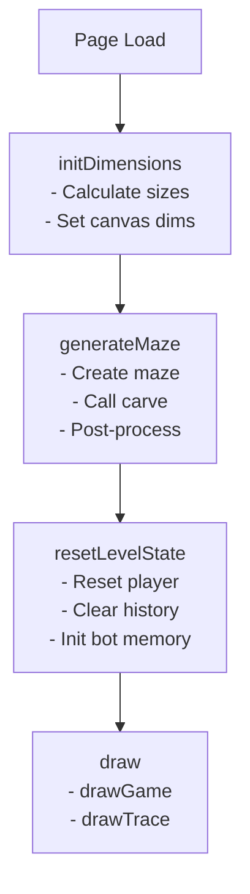
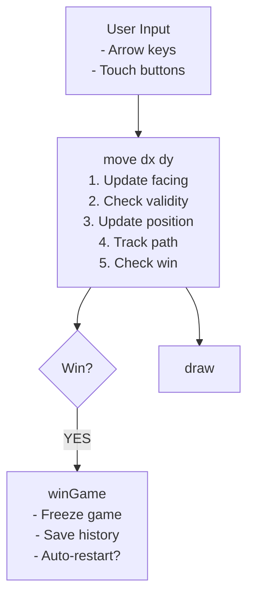
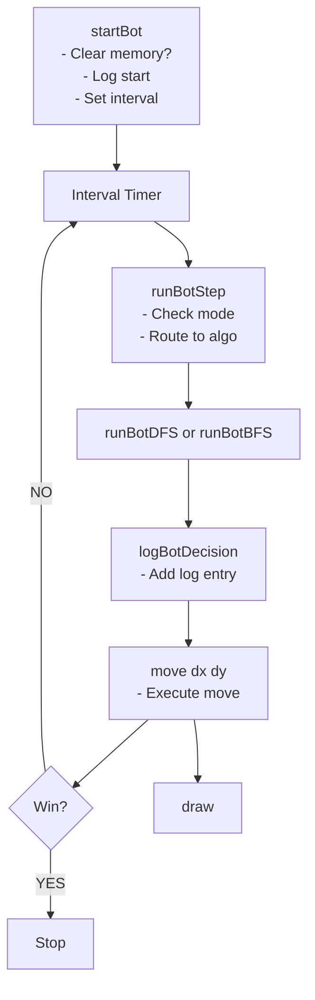
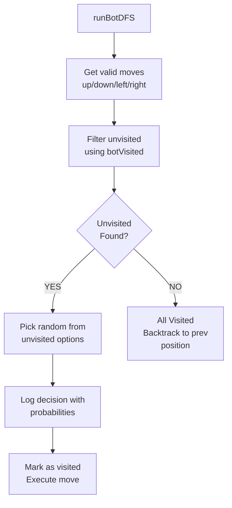
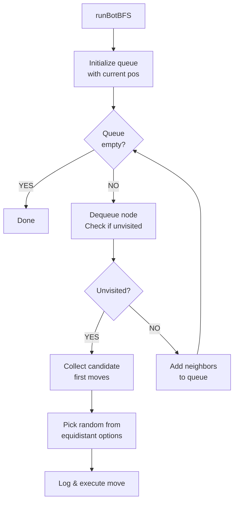
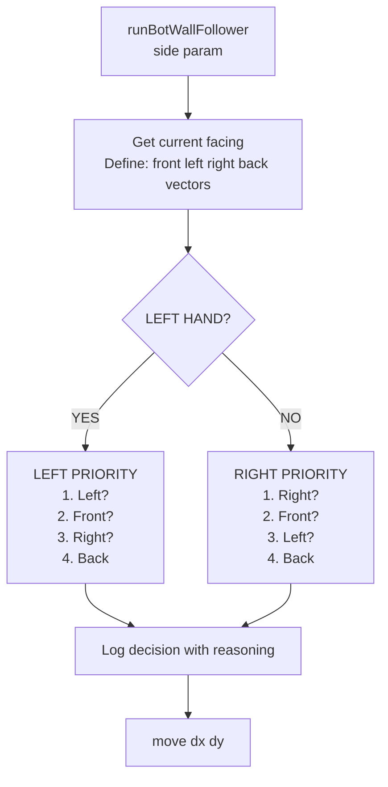
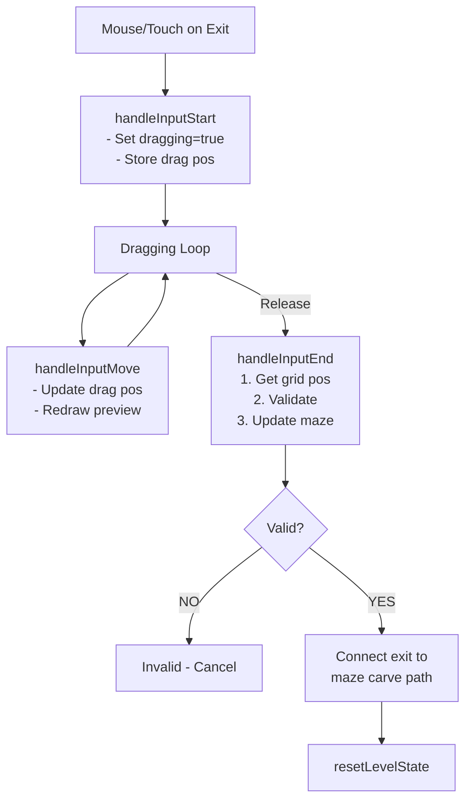
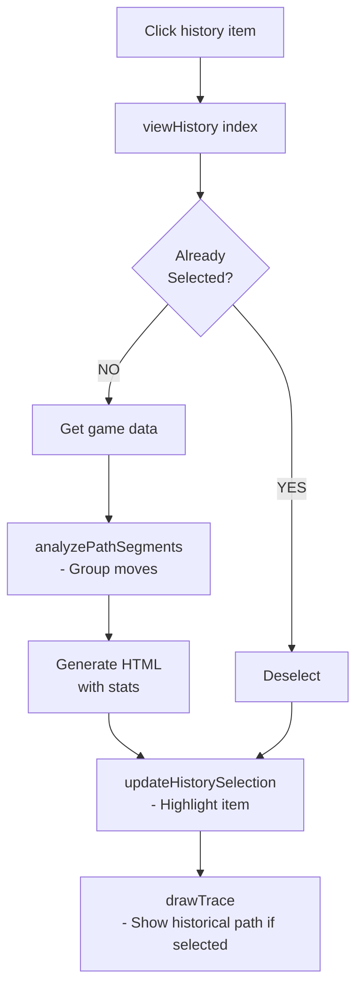

# DwarfMazeGame.html - Function Analysis & Workflow

## Overview
A browser-based maze game where a dwarf navigates through a procedurally generated maze. Supports both human control and multiple AI bot algorithms with visualization of paths and decision-making.

---

## Function Categories & Purposes

### 1. **Initialization & Setup Functions**

#### `initDimensions()`
- **Purpose**: Calculate and set canvas dimensions based on screen size
- **Input**: None (uses window.innerWidth)
- **Output**: Sets COLS, ROWS, TILE_SIZE, canvas dimensions
- **Called by**: Initial load, window resize events

#### `resetLevelState()`
- **Purpose**: Reset game state for new attempt (same maze)
- **Actions**:
  - Reset player position to (0,1)
  - Clear path history and traces
  - Reset score, bot memory, frozen/paused states
  - Clear win timeout
  - Restart bot if in bot mode
- **Called by**: Win game, restart button, maze generation

---

### 2. **Maze Generation Functions**

#### `generateMaze()`
- **Purpose**: Create new procedurally generated maze using recursive backtracking
- **Algorithm Steps**:
  1. Initialize all cells as walls
  2. Call `carve()` from starting point (1,1)
  3. Apply post-processing (remove dead ends if enabled)
  4. Guarantee entrance path (0,1) → (1,1)
  5. Guarantee exit connectivity
  6. Enforce wall thickness (prevent thin walls)
- **Called by**: New map button, auto-restart after win
- **Calls**: `carve()`, `resetLevelState()`

#### `carve(r, c)` (nested function)
- **Purpose**: Recursive depth-first maze carving algorithm
- **Algorithm**: 
  - Mark current cell as path
  - Shuffle directions randomly
  - For each direction, check if unvisited
  - Carve wall between current and next cell
  - Recursively carve from next cell
- **Called by**: `generateMaze()` and recursively by itself

---

### 3. **Player Movement Functions**

#### `move(dx, dy)`
- **Purpose**: Handle player movement in given direction
- **Parameters**: 
  - `dx`: Horizontal movement (-1, 0, 1)
  - `dy`: Vertical movement (-1, 0, 1)
- **Logic**:
  1. Update player facing direction
  2. Validate move (boundaries, walls)
  3. Update path stack and trace
  4. Detect backtracking (returning to previous position)
  5. Check win condition
  6. Update score display
- **Called by**: Keyboard events, button clicks, bot algorithms
- **Returns**: None (updates global state)

---

### 4. **Input Handling Functions**

#### `getMousePos(evt)`
- **Purpose**: Convert mouse/touch coordinates to canvas coordinates
- **Parameters**: Mouse or touch event
- **Returns**: {x, y} position relative to canvas
- **Called by**: Input handlers

#### `handleInputStart(e)`
- **Purpose**: Handle mouse down / touch start events
- **Actions**:
  - Check if clicking on exit position
  - Enable drag mode if on exit
  - Prevent default touch behavior
- **Called by**: Canvas mousedown/touchstart events

#### `handleInputMove(e)`
- **Purpose**: Track dragging position while moving exit
- **Actions**: Update dragPos if dragging active
- **Called by**: Canvas mousemove/touchmove events

#### `handleInputEnd(e)`
- **Purpose**: Complete exit drag operation
- **Actions**:
  1. Get final grid position
  2. Validate new exit position
  3. Update maze to connect exit to path
  4. Reset level with new exit position
- **Called by**: Window mouseup/touchend events

---

### 5. **Game Flow Functions**

#### `winGame()`
- **Purpose**: Handle game completion
- **Actions**:
  1. Freeze player movement
  2. Stop bot
  3. Create game record with statistics
  4. Add to game history
  5. Display win message
  6. Auto-restart if enabled (new maze or same maze)
- **Called by**: `move()` when player reaches exit
- **Calls**: `updateHistoryUI()`, `generateMaze()` or `resetLevelState()`

---

### 6. **History & Analytics Functions**

#### `updateHistoryUI()`
- **Purpose**: Render list of completed games in sidebar
- **Actions**: Generate HTML for each game with ID, mode, steps
- **Called by**: `winGame()`, `viewHistory()`, history operations

#### `viewHistory(index)` (window.viewHistory)
- **Purpose**: Display detailed statistics for selected game
- **Parameters**: Index of game in history array
- **Actions**:
  1. Toggle selection if clicking same game
  2. Generate detailed stats HTML
  3. Call `analyzePathSegments()` for movement summary
  4. Update UI and redraw trace
- **Called by**: Clicking history items in UI

#### `updateHistorySelection()`
- **Purpose**: Refresh history list with current selection highlighted
- **Called by**: `viewHistory()`, `resetLevelState()`

#### `analyzePathSegments(path)`
- **Purpose**: Analyze movement pattern and create summary
- **Parameters**: Array of {x, y} positions
- **Returns**: String like "Right (5) → Down (3) → Left (2)"
- **Logic**: Group consecutive moves in same direction
- **Called by**: `viewHistory()`, save log function

---

### 7. **Bot Control Functions**

#### `startBot(preserveMemory = false)`
- **Purpose**: Initialize and start bot automation
- **Parameters**: 
  - `preserveMemory`: Keep existing visited cells memory
- **Actions**:
  1. Stop any existing bot
  2. Reset or preserve bot memory
  3. Log bot start
  4. Set interval for bot steps based on speed
- **Called by**: Mode change, algorithm change, speed change

#### `stopBot()`
- **Purpose**: Stop bot automation
- **Actions**: Clear bot interval timer
- **Called by**: Mode change, pause, win, manual stop

#### `runBotStep()`
- **Purpose**: Execute one bot decision cycle
- **Actions**: Route to appropriate algorithm based on selection
- **Called by**: Bot interval timer
- **Calls**: Algorithm-specific functions

---

### 8. **Bot Algorithm Functions**

#### `runBotDFS()`
- **Purpose**: Depth-First Search - explores unvisited paths, backtracks when stuck
- **Algorithm**:
  1. Get all valid adjacent moves
  2. Filter for unvisited cells
  3. Pick random unvisited (if available)
  4. Log decision with probabilities
  5. Mark cell as visited
  6. If no unvisited, backtrack to previous position
- **Characteristics**: Memory-based, systematic exploration

#### `runBotBFS()`
- **Purpose**: Breadth-First Search - prioritizes nearest unvisited cells
- **Algorithm**:
  1. Initialize queue with current position
  2. Expand search level by level
  3. Find closest unvisited cells
  4. Determine first move toward nearest unvisited
  5. Pick random among equidistant options
- **Characteristics**: Optimal exploration, finds shortest path to unvisited

#### `runBotRandom()`
- **Purpose**: Random Walk - picks random valid direction each step
- **Algorithm**:
  1. Get all valid adjacent moves
  2. Pick completely random (including backtracking)
  3. Log all options with probabilities
- **Characteristics**: Memoryless, simple, inefficient

#### `runBotWallFollower(side)`
- **Purpose**: Wall Following - keeps left or right wall
- **Parameters**: 'left' or 'right'
- **Algorithm**:
  1. Determine relative directions based on facing
  2. Priority order (left-hand rule):
     - Check side wall → Turn toward it
     - Else check front → Go forward
     - Else check opposite side → Turn away
     - Else → Turn around
  3. Log decision reasoning
- **Characteristics**: Guaranteed to solve simply-connected mazes
- **Helper**: `canMove(vec)` - Check if direction is valid

---

### 9. **Logging Function**

#### `logBotDecision(msg, type='normal')`
- **Purpose**: Add timestamped entry to bot decision log
- **Parameters**:
  - `msg`: Log message text
  - `type`: 'normal', 'action', 'highlight', 'warn'
- **Actions**:
  1. Create log entry div with timestamp
  2. Apply styling based on type
  3. Append to log panel
  4. Auto-scroll to bottom
  5. Limit to 50 entries (remove oldest)
- **Called by**: All bot algorithms

---

### 10. **Rendering Functions**

#### `draw()`
- **Purpose**: Master drawing function
- **Actions**: Call both `drawGame()` and `drawTrace()`
- **Called by**: Any state change requiring visual update

#### `drawGame()`
- **Purpose**: Render main game canvas
- **Draws**:
  1. Background
  2. Maze walls (gray blocks)
  3. Exit (green with "EXIT" text)
  4. Player (orange/yellow dwarf with directional indicators)
  5. Pause overlay if paused
  6. Drag preview if dragging exit
- **Visual Details**:
  - Player has colored body with facing indicators
  - Exit can show drag preview while moving

#### `drawTrace()`
- **Purpose**: Render path trace visualization
- **Features**:
  1. Draw maze outline
  2. Calculate edge traversal counts
  3. Draw path lines with heat map coloring
     - Light red: Few traversals
     - Dark red: Many traversals (up to 108 steps)
  4. Draw start point (green circle)
  5. Draw current position (white circle with border)
  6. Show historical game if viewing history
- **Algorithm**: Aggregates all path segments, colors by frequency

---

## Workflow Diagrams

### Game Initialization Flow


### Human Player Movement Flow


### Bot Operation Flow


### DFS Bot Algorithm Detail


### BFS Bot Algorithm Detail


### Wall Follower Algorithm


### Exit Drag & Drop Flow


### History Viewing Flow


---

## Data Structures

### Global State Variables
```javascript
maze[][]          // 2D array: 0=path, 1=wall
player            // {x, y, facing}
exit              // {x, y}
pathStack[]       // Stack of {x,y} for current path
fullTrace[]       // All positions visited (includes returns)
gameHistory[]     // Array of completed game records
botVisited        // Set of "x,y" strings for bot memory
```

### Game Record Structure
```javascript
{
  id: number,              // Sequential game ID
  mode: string,            // "human" or "bot"
  steps: number,           // Total moves (fullTrace length)
  returns: number,         // Backtracking count
  path: [{x,y},...],       // Complete movement trace
  timestamp: string,       // Time completed
  size: string             // "COLSxROWS"
}
```

---

## Key Features

1. **Procedural Maze Generation**: Recursive backtracking with post-processing
2. **Multiple Bot Algorithms**: DFS, BFS, Random, Wall Following
3. **Path Visualization**: Heat map showing frequency of traversal
4. **Drag & Drop Exit**: Dynamically reposition exit with automatic path connection
5. **Game History**: Track and replay all completed games
6. **Decision Logging**: Real-time bot decision explanations with probabilities
7. **Responsive Design**: Adapts to screen size, supports touch controls
8. **Auto-Restart**: Optional automatic maze regeneration after win

---

## Performance Considerations

- **Maze Generation**: O(n) where n = ROWS × COLS
- **DFS Bot**: O(n) worst case for full exploration
- **BFS Bot**: O(n) per step for breadth-first search
- **Drawing**: Optimized by aggregating path segments
- **Log Size**: Limited to 50 entries to prevent memory buildup

---

## Event Listeners Summary

| Event | Element | Handler | Purpose |
|-------|---------|---------|---------|
| keydown | window | Arrow keys → move() | Keyboard controls |
| mousedown/touchstart | canvas | handleInputStart() | Start exit drag |
| mousemove/touchmove | canvas | handleInputMove() | Track drag position |
| mouseup/touchend | window | handleInputEnd() | Complete exit drag |
| click | buttons | move() | Touch button controls |
| change | modeSelect | Switch human/bot | Game mode |
| change | botAlgoSelect | startBot() | Algorithm selection |
| change | speedSelect | startBot(true) | Speed adjustment |
| resize | window | initDimensions() + draw() | Responsive layout |

---

*Generated: January 24, 2026*
